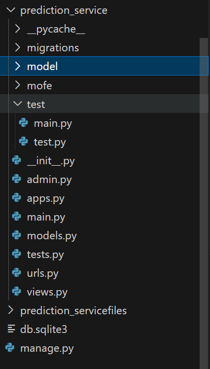
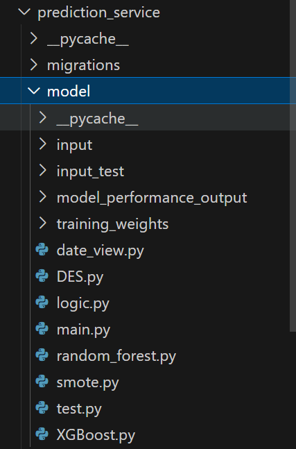

# 毕业设计

> 本程序前端使用的是vue框架，运行在5173端口，后端是django框架，运行在8000端口，请调试好防火墙来做下面程序的验证。

## 后端设计

为了更好的维护代码，本项目采用前后端分离，前端使用vue脚手架搭建应用，后端使用django框架搭建各类应用服务。

python 版本 Python 3.10.13 

backend后端部分采用的是django

frontend前端部分采用vue框架

项目所需环境在environment.yml里，可以使用conda直接导入

下面是使用conda的导入教程

1. **确保你有一个`environment.yml`文件**：这个文件包含了环境的名称、包含的包以及可能的其他依赖信息。它通常看起来像这样：

```
yamlCopy codename: myenv
dependencies:
  - numpy
  - pandas
  - scipy
  - pip:
    - somepippackage==1.0.0
```

1. **打开终端或命令提示符**：在你的计算机上打开终端（Linux或macOS）或命令提示符/PowerShell（Windows）。
2. **导入环境**：导航到包含`environment.yml`文件的目录，然后运行以下命令：

```shell
conda env create -f environment.yml
```

这个命令会读取`environment.yml`文件，并创建一个新的Conda环境，环境的名称和包依赖都是基于文件内容。如果`environment.yml`文件中指定了环境的名称，那么Conda会使用这个名称创建环境。如果你想为环境指定一个不同的名称，可以在创建时不使用`-f`选项直接指定名称，但这样做会忽略`environment.yml`文件中指定的环境名称。

1. **激活新环境**：环境创建完成后，你可以通过以下命令来激活这个环境：

```shell
conda activate django5
```

请将`myenv`替换为你的环境名称，如果你在`environment.yml`文件中使用了不同的名称，或者你在创建环境时指定了一个不同的名称。


## 前端部分

# vue-project前端

安装环境

https://nodejs.org/dist/v20.11.1/node-v20.11.1-x64.msi

运行node -v命令显示版本信息说明安装成功。

```shell
C:\Users\Administrator>node -v
v20.11.1
```

点击这个链接安装nodejs 20版本的windows版本  另外

依次运行下面的命令

## 工程 Setup

```sh
npm install
```

### 运行程序

```sh
npm run dev
```


# 日志

3.19完成前端技术展示代码


3.20完成后端技术展示代码

3.21解决跨域问题。解决文件上传功能，将

3.22完成前后端对接。

## 大事件

3.23完成训练和前后端对接

### 后端django项目介绍

django 采用的是功能化模块管理 ，对于某个功能要执行一个python manage.py startapp your_app的语句来创建这个功能模块

#### 例子

创建预测模块新功能

```shell
python manage.py startapp prediction_service
```



文件夹下多了这个目录 ，然后在graduation的urls下引入预测模块对应的url


### 项目大致介绍

```python
from django.conf import settings
from django.conf.urls.static import static
from django.contrib import admin
from django.urls import include, path

urlpatterns = [
    path("polls/", include("polls.urls")),
    path("admin/", admin.site.urls),
    path('fileupload/', include('fileupload.urls')),
    path('predictss/', include('prediction_service.urls')),
] + static('/images/', document_root='prediction_service/model/model_performance_output')

```

polls路由是测试路由 访问localhost:8000/polls能看到类似于helloworld的内容

admin路由系统用自带不用管

fileupload路由是我创建的可以用于文件上传的功能模块

predictss路由适用于测试模型训练的路由  为何多加两个s 好像系统自带一个predict路由 多加两个s为了便于区分

images路由是静态资源库路由，位置为

rediction_service/model/model_performance_output 用于将该文件夹下的文件放在localhost:8000/images下 如果要访问某个图片 只需要http://localhost:8000/images/《文件名》（方便前端展示图片的）


### 对于测试模块prediction_service

django对于每个功能模块可以设置子路由

prediction_service/urls.py

```python
# predict_service/urls.py
from django.urls import path
from . import views

urlpatterns = [
    path('', views.predict, name='predict'),
    path('list_images/', views.list_images, name='list_images'),

]

```

有两个子路由

一个是根路由  也就是访问http://localhost:8000/predictss/会直接调用predict函数 执行python main.py

第二个是子路由 访问http://localhost:8000/predictss/list_images会调用list_images函数 告诉前端图片文件列表

这些函数需要写到视图文件里 也就是prediction_Service/view.py

```python
from django.http import HttpResponse
import subprocess
import os
import time
#TODO:这个是所谓的访问localhost:8080/predictss路由下就会直接调用 python ./prediction_service/model/main.py --train_file_path ./prediction_service/model/input/internet_service_churn.csv
def predict(request):
    print(f"当前工作目录: {os.getcwd()}")

    script_path = './prediction_service/model/main.py' #这个是模型预测代码放的位置 因为路径原因 必须这么设置
    command = f'python {script_path} --train_file_path ./prediction_service/model/input/internet_service_churn.csv'

    try:
        print("三模型开始预测")
        start_time = time.time()  # 记录开始时间

        # 使用 subprocess.run 执行命令，等待直到命令执行完毕
        result = subprocess.run(command, shell=True, encoding='utf-8', capture_output=True)

        end_time = time.time()  # 记录结束时间
        duration = end_time - start_time  # 计算持续时间
       #然后手动在前端实现进度条  时间就是这里记录的训练所需要的时间
        if result.returncode == 0:
            print(f"Script executed successfully in {duration:.2f} seconds")
            return HttpResponse(f"Script executed successfully in {duration:.2f} seconds", status=201)
        else:
            print(f"Script execution failed after {duration:.2f} seconds")
            return HttpResponse(f"Script execution failed after {duration:.2f} seconds. Error: {result.stderr}", status=500)
    except Exception as e:
        print(f"An error occurred: {e}")
        return HttpResponse(f"An error occurred: {e}", status=500)
#展示图片的视图函数  不用管
from django.http import JsonResponse
import os
from django.conf import settings

def list_images(request):
    directory = os.path.join(settings.BASE_DIR, 'prediction_service', 'model', 'model_performance_output')
    base_url = 'http://localhost:8000/images/'  # 注意根据实际部署情况调整这里的URL
    image_files = [f for f in os.listdir(directory) if os.path.isfile(os.path.join(directory, f)) and f.lower().endswith(('.png', '.jpg', '.jpeg'))]
    
    # 创建完整的URL列表
    image_urls = [base_url + filename for filename in image_files]
    
    return JsonResponse(image_urls, safe=False)

```

## 如何协作



与模型相关的所有的文件都在prediction_service/model这个文件夹下，以后所有的与模型相关的代码都放在这里面，然后对于调用，需要模仿view.py里的predict函数的写法调用model里面的脚本  然后再在prediction_service/urls.py里声明他的子路由  、

```python
 path('list_images/', views.list_images, name='list_images'),
```


##### **合作愉快！**

django运行  在backend目录下

```python
python manage.py runserver

```

